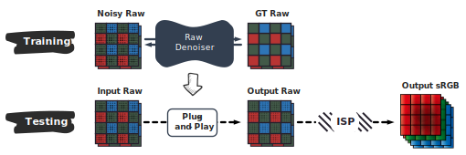
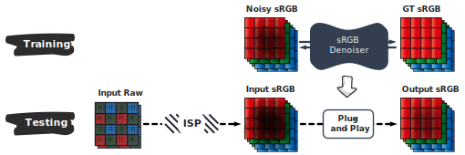
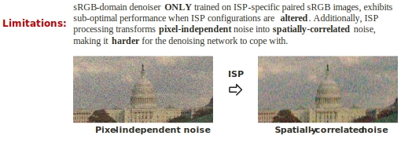
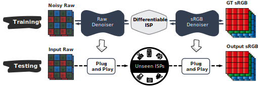
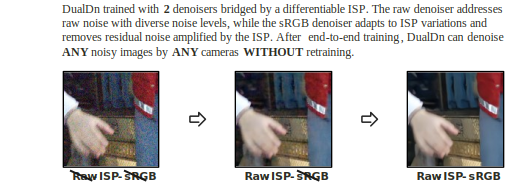
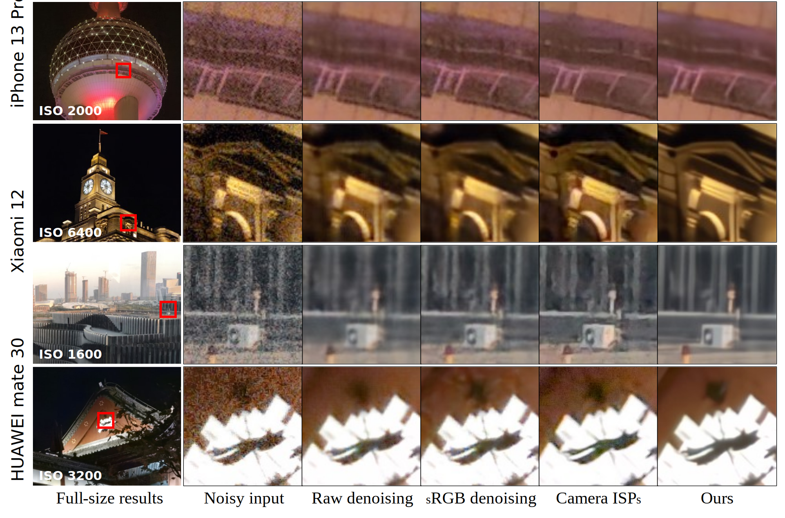

# [ECCV2024] DualDn:   Dual-domain Denoising via Differentiable ISP

<!--  -->

## [Project Page (For more visual results)](https://openimaginglab.github.io/DualDn/)  
[Ruikang Li](https://github.com/Lyricccco), Yujin Wang, [Shiqi Chen](https://tangeego.github.io/), Fan Zhang, [Jinwei Gu](https://www.gujinwei.org/) and [Tianfan Xue](https://tianfan.info/)  

#### News
- **Sept 29, 2024:** Paper accepted at ECCV 2024. 😊
- **Nov 4, 2024:** Training and inferencing code released. 
- **Nov 10, 2024:** Pre-trained models and visual results released. Feel free to download! 
- **Nov 15, 2024:** Project page has evolved to the next generation—check it out! 
- **May 26, 2025:** Give DualDn a spin—any in-the-wild raw shots from any camera right in your browser with our .

#### TODO Lists
- We have captured a new test set with real_captured RAW images, and we will release a new benchmark for dual-denoising.

  <h2>
    Trained with Synthetic Noise.  ONE Model. NO Cherry-Picking. NO Fine-Tuning.
  </h2>

> *DualDn achieves greater generalizability compared to most learning-based denoising methods, as it can adapt to different unseen noises, ISP params, and even black-box ISPs. Experiments show that DualDn achieves SOTA performance and can adapt to various denoising backbones.*
> **Moreover, DualDn can be used as a plug-and-play denoising module with real cameras without retraining, and still demonstrate better performance than original commercial on-camera denoising, which can be seen from the <a href="README.md#results">visual results</a> below.** 

## Try and Play with DualDn on Colab!

 -> A simple inference demo for denoising **ANY** in-the wild raw images by **ANY** cameras.

## Previous Methods
### (1) Raw-domain denoising:

### (2) sRGB-domain denoising:

## Our DualDn

## Framework Architecture

## Installation
See [INSTALL.md](INSTALL.md) for the installation of environment and dependencies required to run DualDn.

## Train and Evaluation
We trained DualDn on a single GPU **ONLY** using: (1) clean raw images, (2) a reasonable noise model. 

We chose the MIT-Adobe FiveK Dataset for training, as it's a robust dataset containing multiple raw images in DNG format with EXIF metadata. 
Although some images contain noise, MIT-Adobe FiveK is sufficient for training DualDn to generalize effectively to in-the-wild scenes. 

And we believe that if more clean raws or a more accurate noise model are given, **DualDn’s performance could improve even further**.

<table>
  <tr>
    <th align="center">Training on</th>
    <th align="center">Evaluating on</th>
    <th align="center">Test Sets</th>
    <th align="center">Instructions</th>
    <th align="center">Pre-trained Model</th>
    <th align="center">Visual Results</th>
  </tr>
  <tr>
    <td rowspan="4" align="center">MIT-Adobe FiveK <a href="https://mycuhk-my.sharepoint.com/:u:/g/personal/1155231343_link_cuhk_edu_hk/EUWR-KgxXD5OsH85ylom4H4BPv2hjYSMAyp4MkopiVnqoQ?e=mfcZBX">Download</a></td>
  </tr>
  <tr>
    <td align="center">Synthetic Images</td>
    <td align="center"><a href="https://mycuhk-my.sharepoint.com/:u:/g/personal/1155231343_link_cuhk_edu_hk/ESu0mEIYmDRFlsm6p6I7BQcBjQKT89iPzph52d0RfbK9Gw?e=bvmyhN">Download</a></td>
    <td align="center"><a href="docs/Synthetic.md#prerequisites">Prerequisites</a> \ <a href="docs/Synthetic.md#train">Train</a> \ <a href="docs/Synthetic.md#test">Test</a> \ <a href="docs/Synthetic.md#inference">Inference</a></td>
    <td align="center"><a href="https://mycuhk-my.sharepoint.com/:u:/g/personal/1155231343_link_cuhk_edu_hk/Eb2uUHfx8pRBimlrVRbR0dUB5arCuP6Vx5g3LKxImOUv3w?e=XLXLKC">Download[1]</a></td>
    <td align="center"><a href="https://mycuhk-my.sharepoint.com/:u:/g/personal/1155231343_link_cuhk_edu_hk/EU8NqzQGahlKrJhh0xgl6rkBg50wN46nLrQW2-buPIN0VQ?e=TFLba5">Download</a></td>
  </tr>
  <tr>
    <td align="center">Real_captured Images</td>
    <td align="center"><a href="https://mycuhk-my.sharepoint.com/:u:/g/personal/1155231343_link_cuhk_edu_hk/EfpMrXegPqVJiCaflRh5UH0B0hYIJh9WjSbzTtGXz67nwQ?e=qKkICu">Download</a></td>
    <td align="center"><a href="docs/Real_captured.md#prerequisites">Prerequisites</a> \ <a href="docs/Real_captured.md#train">Train</a> \ <a href="docs/Real_captured.md#test">Test</a> \ <a href="docs/Real_captured.md#inference">Inference</a></td>
    <td rowspan="2" align="center"><a href="https://mycuhk-my.sharepoint.com/:u:/g/personal/1155231343_link_cuhk_edu_hk/EeSssinwPSRLvC2zOTdmAd8BLLtF3MaKfFw2kYv25WthkQ?e=bbO0Ql">Download[2]</a></td>
    <td align="center"><a href="https://mycuhk-my.sharepoint.com/:u:/g/personal/1155231343_link_cuhk_edu_hk/Ed8o7_yvrB9LtF65CXkWI1sBQhbagoqgDHb99YrdZpo4Kw?e=Lc5Sco">Download</a></td>
  </tr>
  <tr>
    <td align="center"><a href="https://noise.visinf.tu-darmstadt.de/benchmark/#overview">DND Benchmark</a></td>  
    <td align="center"><a href="https://mycuhk-my.sharepoint.com/:u:/g/personal/1155231343_link_cuhk_edu_hk/EfIPJHRaH_VGrxJHD7W60ZEBO79Cet6rKSJsbfQGjue75Q?e=OTDAe0">Download</a></td>
    <td align="center"><a href="docs/DND.md#prerequisites">Prerequisites</a> \ <a href="docs/DND.md#train">Train</a> \ <a href="docs/DND.md#test">Test</a> \ <a href="docs/DND.md#inference">Inference</a></td>
    <td align="center"><a href="https://mycuhk-my.sharepoint.com/:u:/g/personal/1155231343_link_cuhk_edu_hk/EbS2nOKb_fhFtGb_kiz1nM8BFLYv1DqsZ3ZZhguQo9sBgQ?e=MlTfqO">Download</a></td>
  </tr>
</table>

**HINTS:** We only provide models and results trained using [Restormer](https://github.com/swz30/Restormer) backbone, as it demonstrated the best performance in DualDn. 
However, you can also train DualDn with other backbones, such as [SwinIR](https://github.com/JingyunLiang/SwinIR) or [MIRNet-v2](https://github.com/swz30/MIRNetv2), by following our instructions. 
Reference evaluation metrics are also available in our paper.

[1] For those who want to reproduce the Sec 4.1 experiment (i.e. fast comparison between DualDn and single raw/sRGB denoising methods) in our paper, which is only trained with selected 200 raws.  
[2] For those who want to denoise **ANY** in-the wild raw images by **ANY** cameras (i.e. all results showed on our [website](https://openimaginglab.github.io/DualDn/)), which is trained with the entire MIT-Adobe FiveK dataset (~5,000 raws).

## Results

## Citation

    @inproceedings{li2025dualdn,
      title={Dualdn: Dual-domain denoising via differentiable isp},
      author={Li, Ruikang and Wang, Yujin and Chen, Shiqi and Zhang, Fan and Gu, Jinwei and Xue, Tianfan},
      booktitle={European Conference on Computer Vision},
      pages={160--177},
      year={2025},
      organization={Springer}
    }

## License

<a rel="license" href="https://creativecommons.org/licenses/by-nc/4.0/">

This repository is licensed under [Attribution-NonCommercial 4.0 International](https://creativecommons.org/licenses/by-nc/4.0/deed.en)
1. **Attribution** — Proper credit must be given, including a link to the license and an indication of any modifications made. This should be done in a reasonable manner, without implying endorsement by the licensor

2. **NonCommercial** — The Algorithm may **NOT** be used for commercial purposes. This includes, but is not limited to, the sale, licensing, or integration of the Software into commercial products or services.

For collaboration or inquiries, please contact us.

## Acknowledgement

This code is based on the [BasicSR](https://github.com/xinntao/BasicSR) toolbox. 
